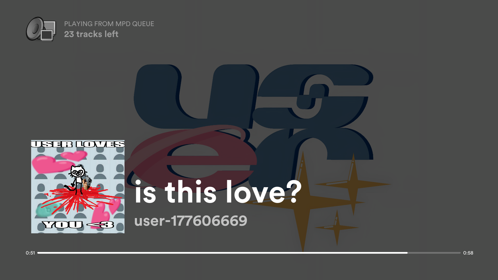
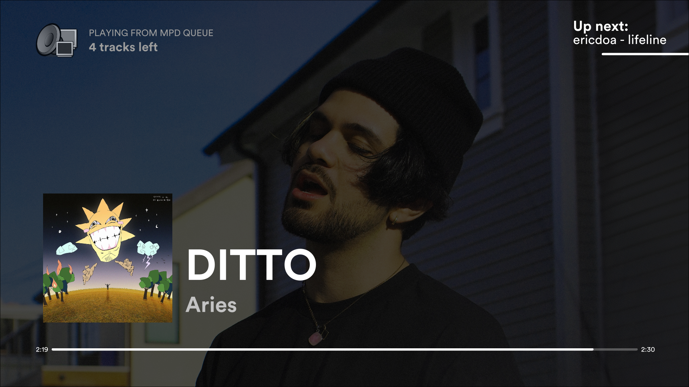
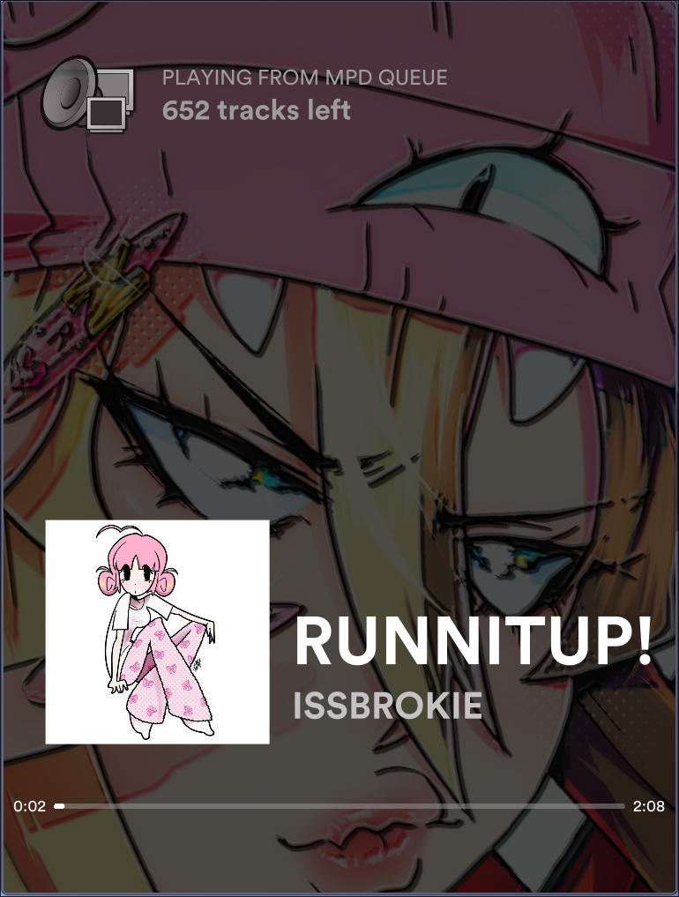
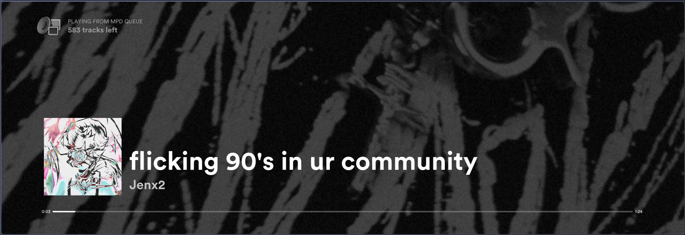
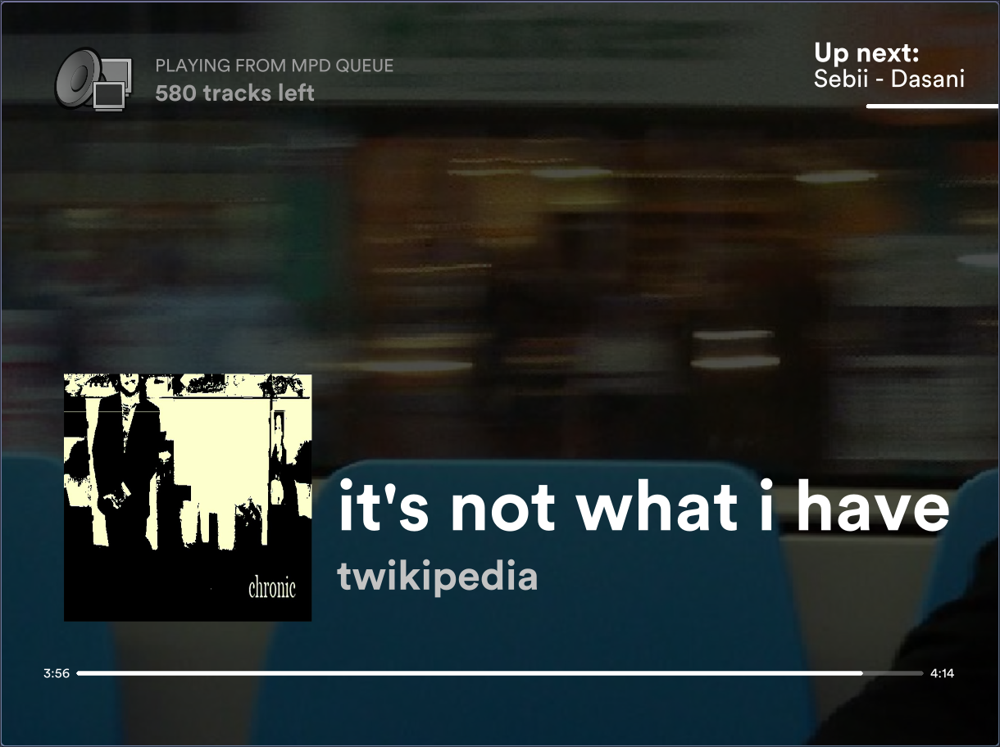
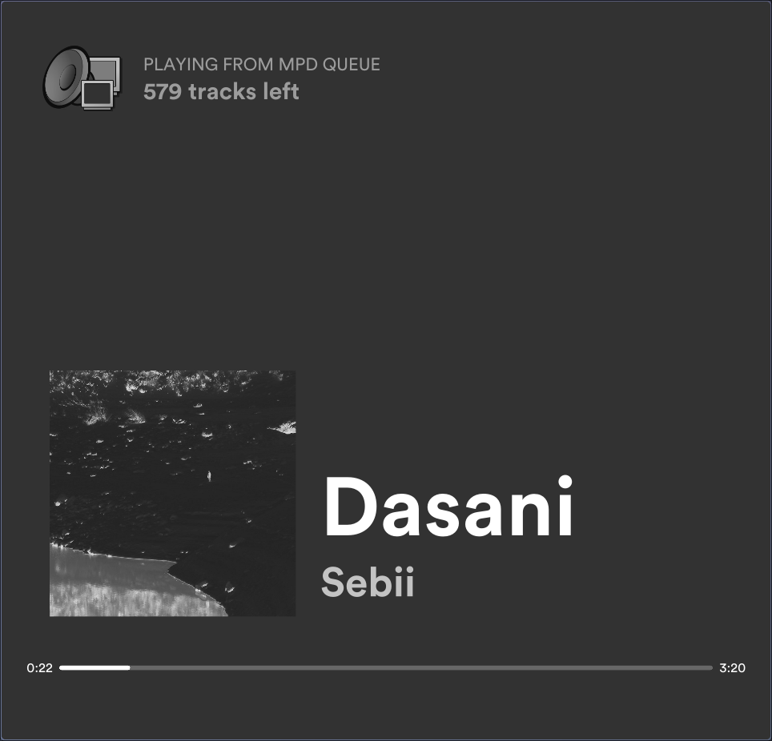
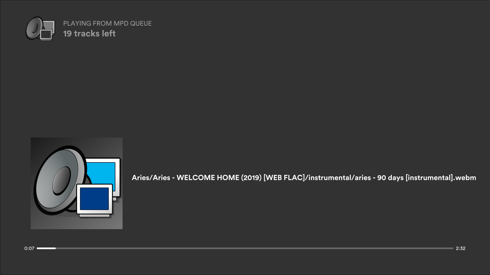
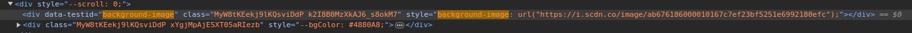
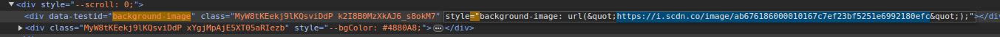

# mpd-display-rs: A Spotify-like graphical display for MPD

Note that this is not a full MPD client, as it only *displays* data.

This is a replacement for my old [mpd-display](https://github.com/allylikesu/mpd-display), which was coded in Python using the Pygame engine. It was coded in one night, and I am not very proud of it.

### Improvements from python version
- Faster start-up
- Much lighter-weight, using Rust's [speedy2d](https://crates.io/crates/speedy2d) crate
- Smooth updating progress bar
- Doesn't spam mpc commands every frame (Uses the [mpd](https://crates.io/crates/mpd) crate for updating status every frame, gets album art on song change using `mpc readpicture`)
- Many more. The amount of sins that were committed in that old version still keep me up at night.
### Regressions from python version
- Doesn't work properly under Wayland, must be launched with WINIT_UNIX_BACKEND=x11 ([speedy2d issue](https://github.com/QuantumBadger/Speedy2D/issues/112))
- I used a lot of `unwrap()` on calls to mpd instead of proper error handling, so random crashes may be more common. I'll work on it.
- Too lazy to implement the background gradient based on album art colors if there is no background image found for the current artist, I think the default grey background looks fine.
- Doesn't use MPD_HOST and MPD_PORT env variables (I'll fix this soon)

Only tested on Linux. Requires MPC.

## Features
- Toggleable fullscreen with the `f` key
- Fully reactive window, all screen elements will be properly scaled/positioned
- Artist-specific background art (See more [here](#obtaining-and-using-artist-background-images-from-spotify))
- Design basically fully ripped off of the Spotify desktop client's fullscreen mode
- Click or press space to play/pause
- "Up Next" display when current song hits 90% completion
- Easy to quit with `Esc`

## Screenshots














## Installation/Usage
I'm too lazy to figure out how to make a proper cargo package.

Clone the repo, run `cargo build --release`, then create a startup script to execute the binary in the crate directory:
```
#!/usr/bin/env bash
cd <PATH TO CLONED REPO> || exit 1

# Use this line if you're using Wayland
#WINIT_UNIX_BACKEND=x11 target/release/mpd-display-rs

# Use this line if you're not using Wayland
target/release/mpd-display-rs
```

## Obtaining and using artist background images from Spotify
For Spotify's fullscreen mode, it uses a slightly darkened version of the main artist's profile banner as a background.
If the artist does not have a profile banner, a gradient based on the song's album art is used.

This behaviour is replicated by this program, but the images need to be manually obtained.
If you don't care about Spotify and have your own images you want to use, that is totally cool!
The format of the file should be `<artist name>.jpg`.
The file name should be in **ALL LOWERCASE!**

Obtaining profile banners from Spotify is simple but a little annoying. 
1. navigate to the artist's profile on the Spotify web client. Using Firefox might not work, I had to do this in Chromium.
2. Press `Ctrl+Shift+I` to enter the developer console and inspect the element of the page.
3. Press `Ctrl+F` to open the search prompt. Search for `"background-image:` (Note the quote and colon!). The first result should look like this.

4. Copy the i.scdn.co link. This is the link to the image. Make sure to *NOT* copy the `&quot;` before and after the link.

5. Open this link in your browser. Right click and save it to the `artists/` folder as `<lowercase artist name>.jpg`

### Artist name parsing
In order to display the correct image, this program parses the first artist in the song's artist metadata. There are multiple formats used to separate artist names in this metadata, and improperly parsing this data can cause the program to search for the wrong image file. Current delimeters used are `,_`, `/`, `_&_`, and `;_` (underscores representing spaces). If you encounter issues due to your files using a different format, please open an issue.

## Contributions
If you encounter an issue, open an issue. If you want to contribute... good luck. I'm not too good at rust yet, and this code is rather messy.
